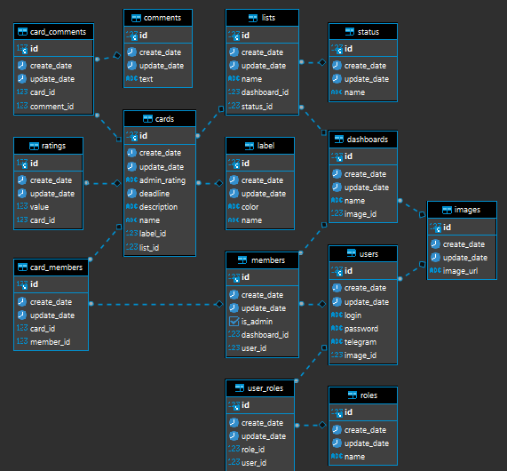

# Maken - инструмент для управления проектом и планированием задач

Authors:

Цель:

Организовать работу команды 
Улучшить коммуникацию между членами команды 
Улучшить процесс управления проектом 

Назначение: 
Оптимальное управление проектом 
Планирование задач 

Функциональные требования: 
Авторзация 
Аунтификация 

Создание доски, списка, карточки 

Добавление участника на доску 
Метка критичности и сложности задачи 
Фиксирование сроков 
Добавление описания задачи 
Добавление комментария к задаче 
Отметка участника на задачу 
Рейтинг участников по выполненым задачам 
Уведомление о сроках связать с ботом в телеграмме: 
1.Уведомление о сроках 
2.Уведомление об оценке 
Перемещение карточек по спискам 
Редактирование доски, карточки, списка 

Админ: 
Удаление карточки  
Удаление участников  
Удаление списка  
Удаление доски  
Назначение админа 
Оценка таска 

Нефункциональные требования: 
Валидация передаваемых данных 

